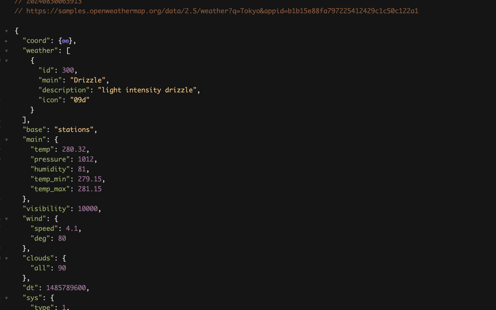

# Acurast Example App: Fetch

This repository shows how to set up and run a project with fetch on Acurast.

## Setup

### Requirements

To set up this project on your computer, make sure to have `node.js` installed. Then run

```bash
npm i
```

### Build and Bundle

To build and bundle the project into a single executable, run

```bash
npm run bundle
```

This will create the file `./dist/bundle.js`.

> [!TIP]
> Run `node ./dist/bundle.js` to check if the app works on your computer

### Deployment on Acurast

The deployment is done with the Acurast CLI. Make sure to create a `.env` file according to the [docs](https://github.com/Acurast/acurast-cli?tab=readme-ov-file#example-configuration) and adjust the `acurast.json` configuration as you wish. Then run `npm run deploy` to deploy the code.
